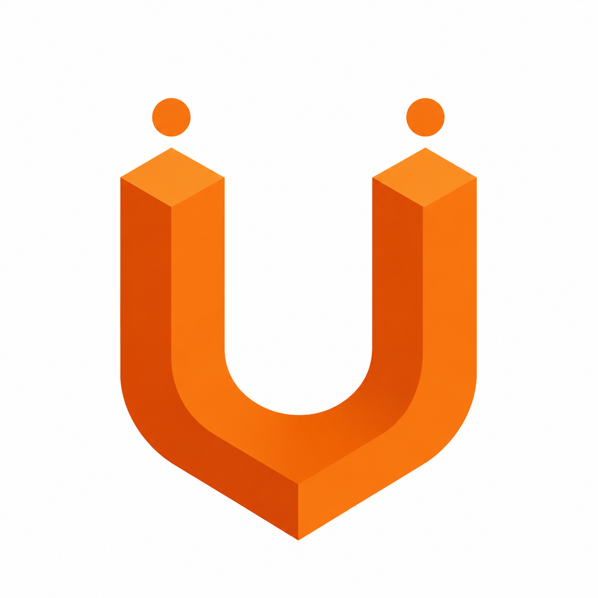
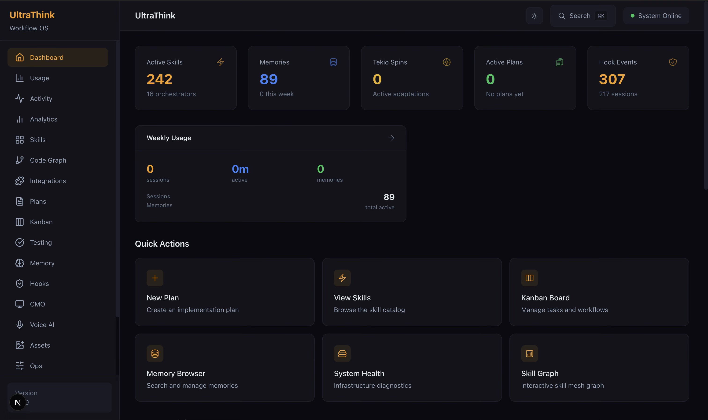
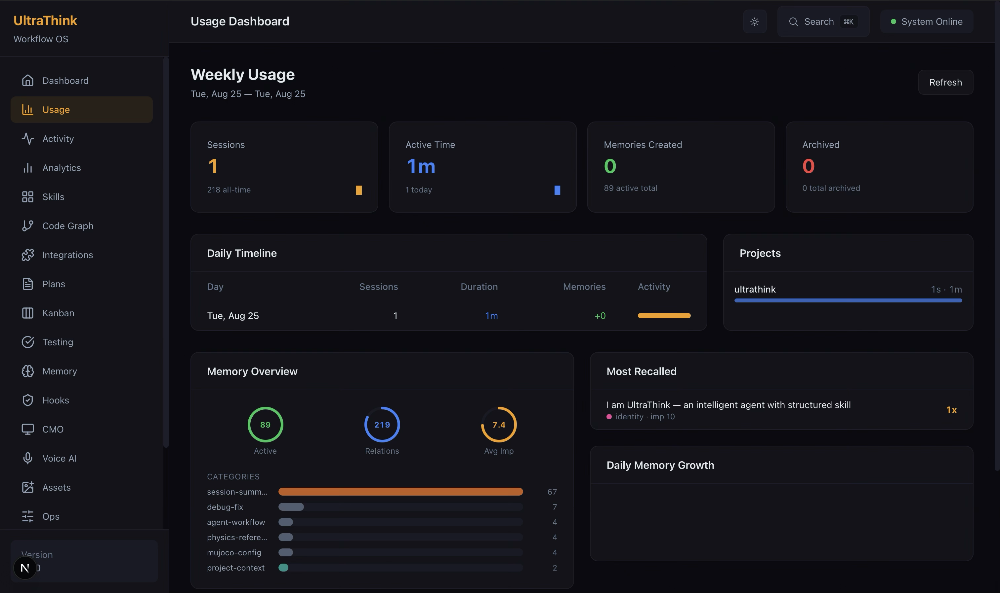
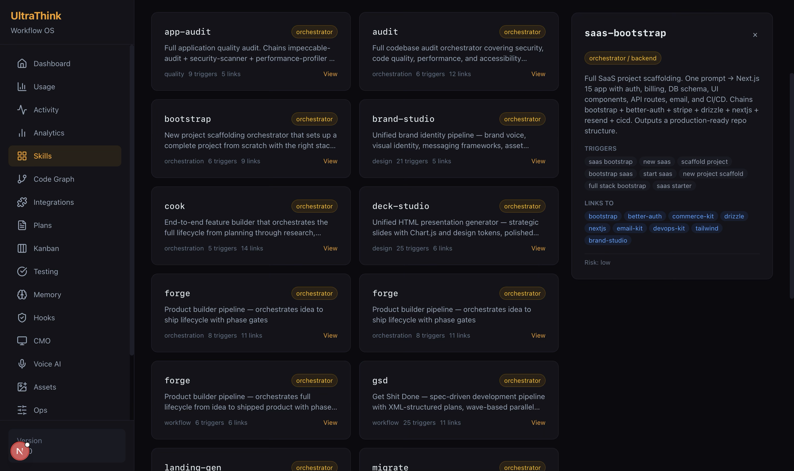
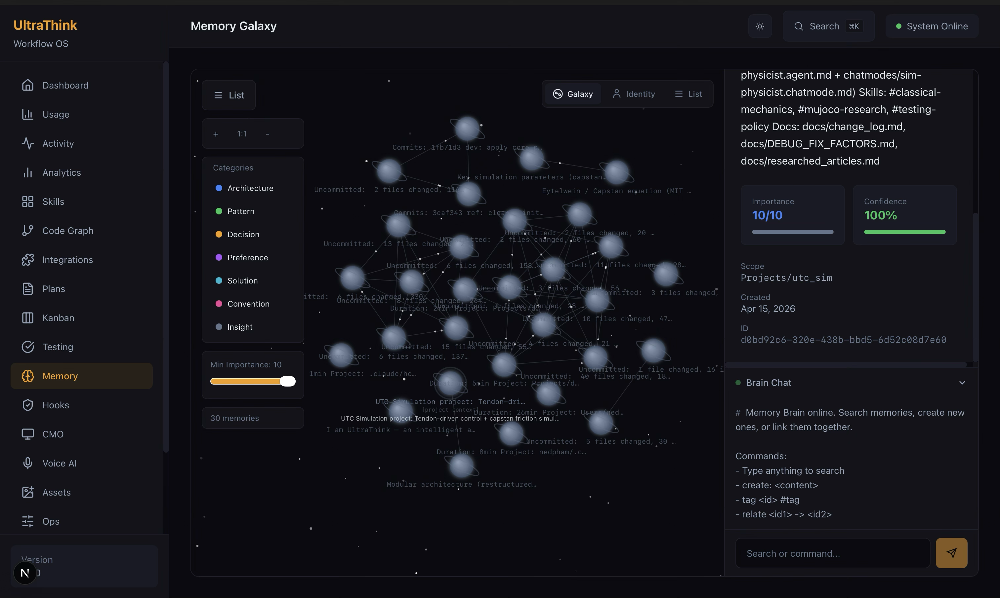
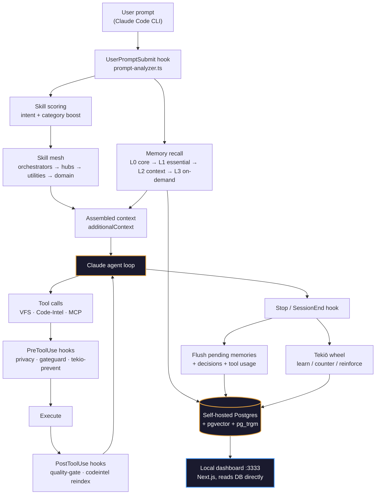
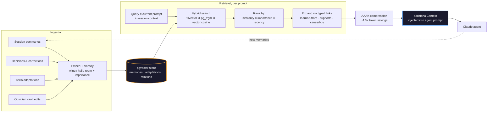

<p align="center">
  
</p>

<h1 align="center">UltraThink — Core</h1>
<p align="center">
  <strong>Build Until Ship.</strong> Your pipeline, your server, your database — nobody else's cloud.
</p>

<p align="center">
  <a href="#install">Install</a> •
  <a href="#what-you-get">Features</a> •
  <a href="#install-a-skill-pack">Skill packs</a> •
  <a href="#harness-architecture">Harness</a> •
  <a href="#rag-pipeline">RAG</a> •
  <a href="#license">License</a>
</p>

---

UltraThink is an opinionated workflow OS for AI coding agents. It turns Claude Code
(and Codex, OpenAI-compatible runners, Ollama) from a stateless chat into a
**persistent, skill-aware engineer** that remembers your decisions, enforces your
standards, and adapts to how *you* build software — running entirely on a local
host server and a database you own.

**Our principle:** software gets shipped by people who own their pipeline.
UltraThink gives you the pipeline. You own it. You ship.

This is the **Core** distribution — the private superset of the [public OSS
release](https://github.com/InugamiDev/ultrathink-oss), with Tekiō adaptive
learning, Agora voice integration, and InuVerse's proprietary skill allowlist
included. Everything below runs end-to-end on your laptop: skill mesh,
persistent memory, dashboard, code-intel graph — no phoning home.

## What you get

- **232 skills** in a 4-layer mesh (orchestrator → hub → utility → domain),
  auto-routed per prompt by a scoring hook
- **Persistent memory** on Postgres — 4-wing knowledge graph (agent / user /
  knowledge / experience), hybrid `tsvector` + `pg_trgm` + vector search, and
  Zettelkasten-typed relations
- **Tekiō (適応)** — an unlimited adaptive-learning wheel: new situations get
  learned, known ones get skipped, failures get countered, successes get
  reinforced. *Core-only.*
- **Code intelligence** — 5 cross-file dependency MCP tools that answer "what
  breaks if I change this?" without reading a single file
- **Decision engine** — 12 reasoning frameworks injected when a prompt smells
  like a real architectural call
- **Identity graph** — long-term `who is this user, what do they prefer, what are they building`, surviving session boundaries
- **VFS** — AST-signature MCP for code exploration, 60–98% token savings
- **Studio** — cross-platform Tauri desktop app: 3D knowledge graph,
  project-first chat, concurrent agent runner, OS keychain, checkpoints
- **Dashboard** — Next.js 15 observability surface at `:3333` (memory graph,
  activity, hooks, skills, ops, kanban, analytics)
- **install-pack.sh** — `./scripts/install-pack.sh https://github.com/acme/skills`
  drops any skill repo into your workflow

## Dashboard

<table>
<tr>
<td width="50%">

<p align="center"><sub>Live ops dashboard — skills, memories, Tekiō spins, hook events</sub></p>
</td>
<td width="50%">

<p align="center"><sub>Usage analytics — sessions, active time, per-project breakdown</sub></p>
</td>
</tr>
<tr>
<td width="50%">

<p align="center"><sub>Skill mesh browser — triggers, links, risk per skill</sub></p>
</td>
<td width="50%">

<p align="center"><sub>Memory Galaxy — the second-brain graph, force-laid-out</sub></p>
</td>
</tr>
</table>

## Install

### One-liner

```sh
curl -fsSL https://raw.githubusercontent.com/nhan03bit/ultrathink/main/scripts/install-studio.sh \
  | OSS_REPO=https://github.com/nhan03bit/ultrathink.git bash
```

This clones the repo to `~/ultrathink`, installs deps, builds `Studio.app`, and
(macOS) symlinks it into `/Applications/`. Prereqs: **Node 22+**, **pnpm 9+**,
**Rust 1.77+** (for the Studio Tauri build). It tells you what's missing.

After install, edit `~/ultrathink/.env` and set:

- `DATABASE_URL=postgres://...neon.tech/...` — required for the memory graph
- `ANTHROPIC_API_KEY=sk-ant-...` — optional if you already have the `claude` CLI

Open Studio: `open '/Applications/UltraThink Studio.app'` (or run from
`~/ultrathink/apps/studio/src-tauri/target/release/bundle/macos/`).

### Manual

```sh
git clone https://github.com/nhan03bit/ultrathink.git ~/ultrathink
cd ~/ultrathink
cp .env.example .env          # set DATABASE_URL + ANTHROPIC_API_KEY
pnpm install                  # workspace deps (Node 22+, pnpm 9+)
pnpm run install:global       # installs the harness globally — see below
cd apps/studio && pnpm tauri:dev   # or: pnpm tauri:build
```

### Global harness install

`pnpm run install:global` (alias for `./scripts/install.sh`, defined in the
root `package.json`) is the step that actually makes UltraThink a *harness*
rather than just a cloned repo: it symlinks every skill into
`~/.claude/skills/`, registers all hooks in `~/.claude/settings.json`, adds
the UltraThink section to `~/.claude/CLAUDE.md`, and links Codex/OpenAI-
compatible runner templates into `~/.codex/` — all scoped to your user
account, not this repo. Once it's run, the harness is active in **every**
Claude Code / Codex session on the machine, not just inside `~/ultrathink`.

```sh
./scripts/install.sh --tier=core --db="$DATABASE_URL" --yes
```

| Flag | Effect |
|---|---|
| `--tier=oss\|core` | Installation tier (auto-detected from the repo if omitted) |
| `--db=URL` | Postgres connection string — pre-fills `DATABASE_URL` instead of prompting |
| `--vault=PATH` | Obsidian vault location (default `~/.ultrathink/vault`) |
| `--no-identity` | Skip adding the UltraThink section to `~/.claude/CLAUDE.md` |
| `--no-runners` | Skip linking Codex/OpenAI-compatible runner files |
| `--yes`, `-y` | Auto-approve all prompts (non-interactive/CI installs) |
| `--dry-run` | Print what would change without touching anything |
| `--update` | Pull latest changes and re-install |
| `--uninstall` | Remove UltraThink from `~/.claude/` and `~/.ultrathink/` |

Re-run it any time — `--update` after a `git pull` re-symlinks new skills and
picks up hook changes without a full reinstall.

### Verify

```sh
npx tsx packages/memory/scripts/memory-runner.ts session-start   # memory engine
pnpm --filter dashboard dev && open http://localhost:3333        # dashboard
```

## Install a skill pack

The killer move — drop someone else's skill repo into your workflow:

```sh
./scripts/install-pack.sh https://github.com/acme/awesome-skills
```

Optional name prefix to avoid collisions:

```sh
./scripts/install-pack.sh https://github.com/acme/awesome-skills acme-
```

That's `Build Until Ship` in two lines: someone else's pipeline becomes yours,
your next prompt sees it, you keep moving.

## Harness architecture

Recent agent research draws a sharp line between the **model** and the
**harness** — the executable runtime around the model that constructs
context, mediates tool calls, validates actions, and recovers from failure.
[*Harness‑R1: Learning to Edit Executable Runtime Harnesses from Agent
Failure Trajectories*](https://arxiv.org/abs/2608.02276) (Shao et al., 2026)
shows the harness is where most of an agent's reliability is won or lost, and
that harnesses which *learn from their own failure trajectories* meaningfully
outperform static ones (+9.3 pts success rate on WebShop / ALFWorld / DBBench).

UltraThink applies the same premise, practically rather than academically:

| Harness‑R1 concept                | UltraThink implementation                                                                                            |
| ---------------------------------- | -------------------------------------------------------------------------------------------------------------------- |
| Context construction               | 4-layer skill mesh + tiered memory recall (L0–L3)                                                                   |
| Tool mediation                     | Pre/Post-tool hooks, VFS-first code exploration, MCP tool registry                                                   |
| Action validation                  | Privacy hooks, quality gates, gateguard, config-protection                                                           |
| Execution recovery                 | Tekiō — every tool failure is scored, countered, and remembered                                                    |
| Learning from failure trajectories | `wheel-correct` / `wheel-learn` — corrections and confirmed successes become durable adaptations, not just logs |

The difference: instead of a 9B "engineer" model patching the harness at
inference time, UltraThink's harness is edited directly — hooks, skills, and
memory rules are plain files you own, version, and diff.



Every box above is a file you can open and edit — hooks in
`.claude/hooks/*.sh`, skills in `.claude/skills/*/SKILL.md`, memory in
`packages/memory/`.

## RAG pipeline

UltraThink's "second brain" isn't a black box vector store. It's a hybrid
retrieval system — full-text (`tsvector`), fuzzy trigram (`pg_trgm`), and
vector similarity (`pgvector`) — all queried against the same self-hosted
Postgres instance, with a Zettelkasten link graph layered on top for
relation-aware recall.



**Why hybrid, not pure vector search:** exact terms (file paths, function
names, error strings) match better on `tsvector`/`pg_trgm` than on embeddings
alone; semantic recall ("have we solved something like this before") needs
the vector side. Running both against one self-hosted database means no
round trip to a third-party vector API, and the link graph gives retrieval a
memory of *why* two facts are related, not just that they're similar.

## Tech stack

| Area              | Stack                                                                       |
| ----------------- | --------------------------------------------------------------------------- |
| Runtime           | Claude Code CLI (+ Codex, OpenAI-compatible, Ollama)                        |
| Dashboard         | Next.js 15 + Tailwind v4, served locally on port 3333                       |
| Studio            | Tauri desktop app (Rust + web)                                              |
| Database          | Postgres (Neon or self-hosted) +`pgvector` + `pg_trgm`                  |
| Memory            | Hybrid tsvector + trigram + vector search, 4-wing second-brain architecture |
| Hooks             | Bash + TypeScript, pre/post tool hooks, auto-trigger skill scoring          |
| Code intelligence | VFS (AST signatures) + Postgres-backed dependency graph, MCP-exposed        |
| Skills            | 232 skills, 4 layers, linked via a registry graph                           |

## Key paths

| Area              | Path                               |
| ----------------- | ---------------------------------- |
| Skills            | `.claude/skills/[name]/SKILL.md` |
| Hooks             | `.claude/hooks/*.sh`             |
| Memory engine     | `packages/memory/`               |
| Code intelligence | `packages/code-intel/`           |
| Dashboard         | `apps/dashboard/`                |
| Studio            | `apps/studio/`                   |
| Vault (Obsidian)  | `~/.ultrathink/vault/`           |

## Core vs OSS

This repo is **Core** — the private distribution. The [public OSS
repo](https://github.com/InugamiDev/ultrathink-oss) is MIT-licensed and
ships everything except:

- **Tekiō** adaptive learning
- **Agora** voice integration (separately licensed)
- A handful of proprietary domain skills under InuVerse's allowlist

## License

[Functional Source License 1.1, Apache 2.0 Future License](LICENSE)
(FSL-1.1-Apache-2.0), Licensor: **InuVerse**. Free to use, modify, and
self-host; converts to Apache-2.0 automatically after the license's grace
period. The public OSS sibling is MIT — see above.

---

<p align="center">
  <em>UltraThink isn't the AI. UltraThink is <strong>you</strong> — and it makes you the master of your AI.</em>
</p>
